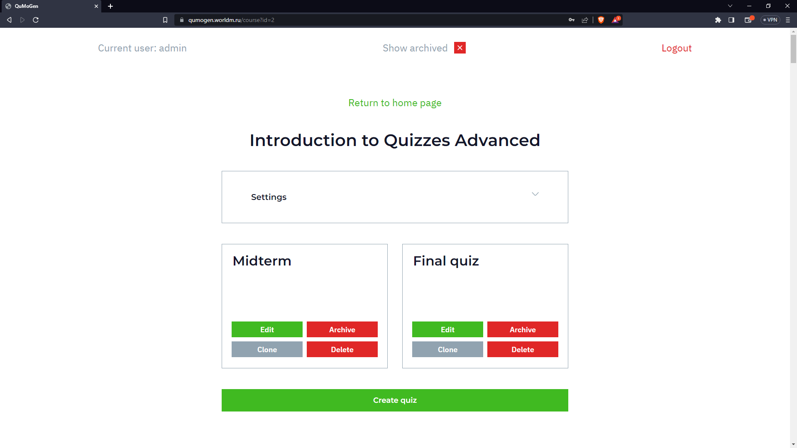
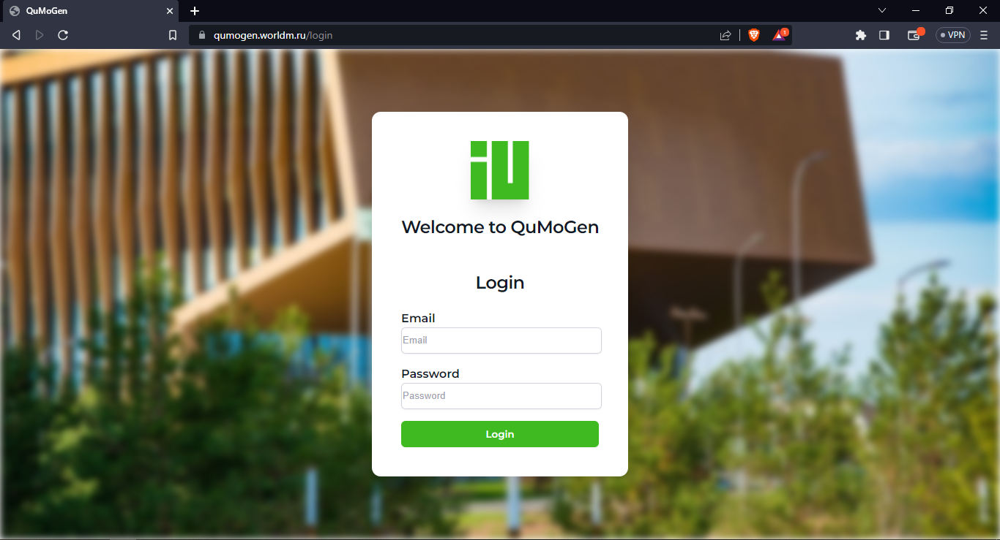
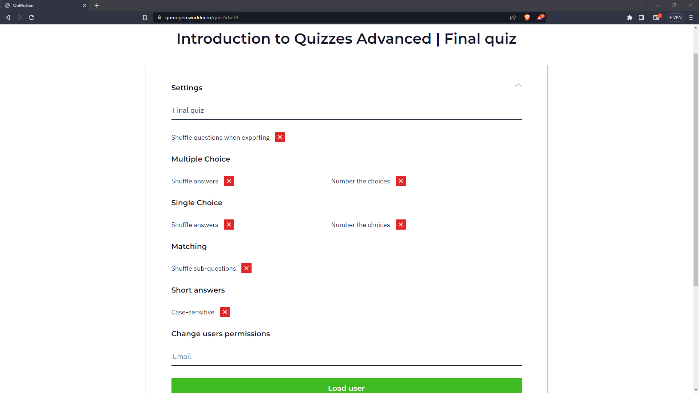
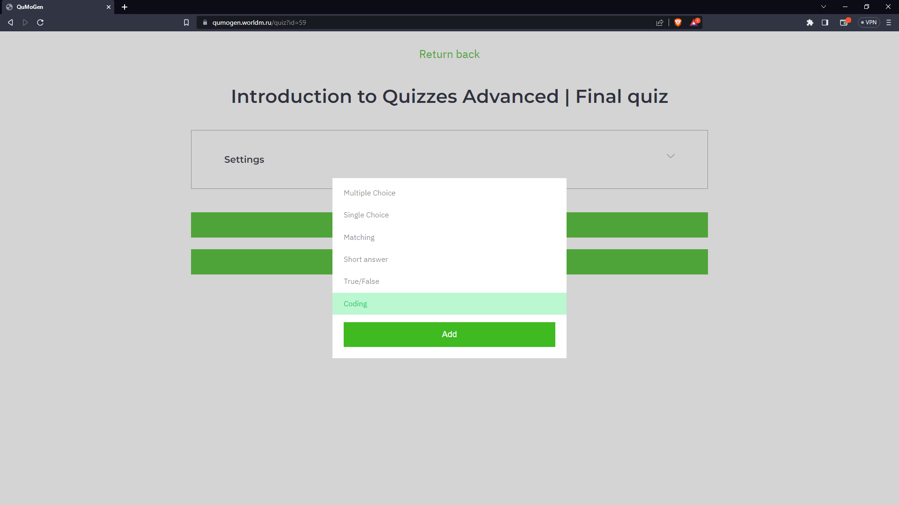
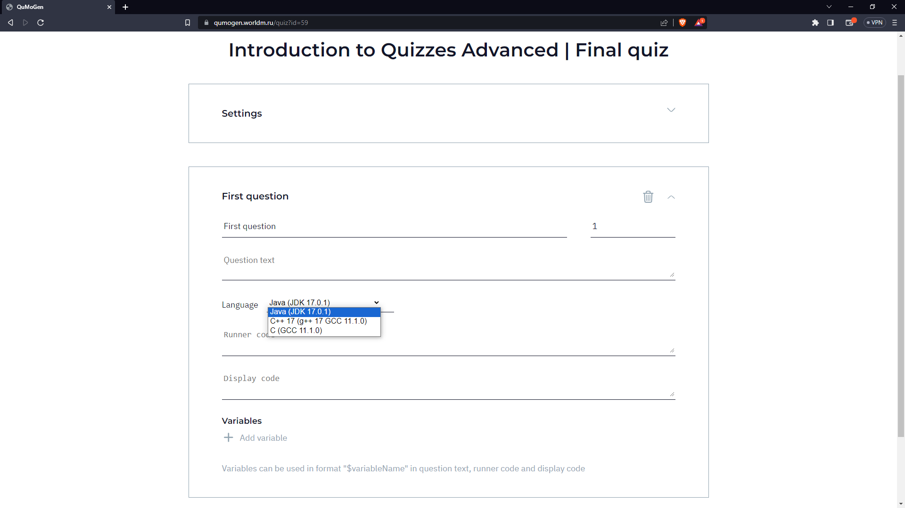
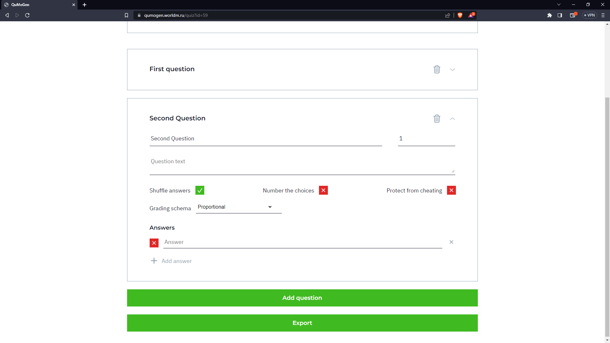
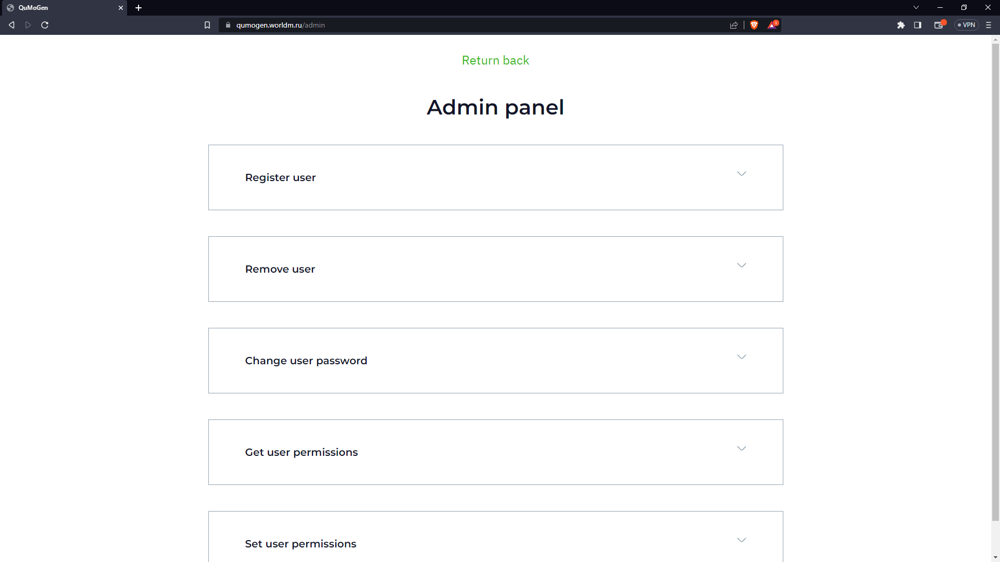

<h1 align="center"> Advanced External Moodle Quiz Generator</h1>
<h4 align="center"> The constantly-growing number of students at Innopolis University pushes to make grading more automatic for saving time of TAs,
 getting unbiased quick results with the feedback. Moodle quizzes are one of the tools being used since 2015-2016 at IU.
 However, repeating the same questions yearly does not seem a good idea, which pushes regularly to rebuild the questions.
 Moodle quizzes are providing rich functionality for preparing automatic questions.
 However, in some cases the power of Moodle quizzes is not enough to make questions flexible enough,
 which results into excess manual work. Fortunately, it is possible to insert questions into the quiz from external sources
 in given formats like XML and so on. Thus, the our ecternal quiz generator tool is able to produce a course-specific flexible
 questions for quizzes in Moodle.</h4>

 
  

<h2>:pencil: About The Project</h2>

<a href="https://qumogen.worldm.ru/login">Moodle Quiz Generator</a> project is a tool that is ment to be an extention to Innopolis university moodle: https://moodle.innopolis.university/

## Features of the project over the original Moodle:
#### Advanced Code-Based Questions: 
The new system allows the creation of calculated questions with varying codes and their compilation and execution for preparing valid and invalid solutions. This feature enables instructors to design more complex and dynamic programming assessments.

#### Code Protection: 
To prevent quiz participants from copying the codes for testing in external compilers, the system can convert code-containing text into images. This makes it harder for students to extract the code and encourages them to attempt the problems within the quiz environment.

#### Formatting Preservation: 
When copying questions from external sources into Moodle, unintentional formatting issues may arise. The new system takes measures to ensure that the formatting of copied questions is preserved correctly, reducing the need for manual adjustments.

#### Question Templates: 
The new system supports question templates, such as "Which of those statement(s) about TOPIC is/are correct?" This feature simplifies the process of creating consistent question formats and structures across various quizzes.

#### Domain-Specific Questions: 
Some courses may require specific questions tailored to the subject's domain. The new system allows instructors to create domain-specific questions, like "Use minimax algorithm for a given tree," catering to the specific needs of the course.

#### Flexible Grading Policies: 
The system provides enhanced grading options for multiple-choice questions and other question types. Instructors can choose grading policies at the top-level, giving them greater control over the assessment process.

#### Yearly Question Variation: 
For questions that are repeated yearly, the system allows the generation of different subsets of answers. This feature introduces variety into the assessments, keeping them fresh and challenging for returning students. The ability to randomize answer subsets ensures fairness and prevents unfair advantage for students who may have access to previous years' questions.

## :camera: Screeshots

* The website require a Login to enter and use the tool:

---

* You can choose from the courses that are assighned to you then add a Quiz:

---

* There is multiple choices to choose a question from

---

* Coding question:

---

* Multiple choice question:

---

* Also we have a admin pannel for admin accounts:

---
